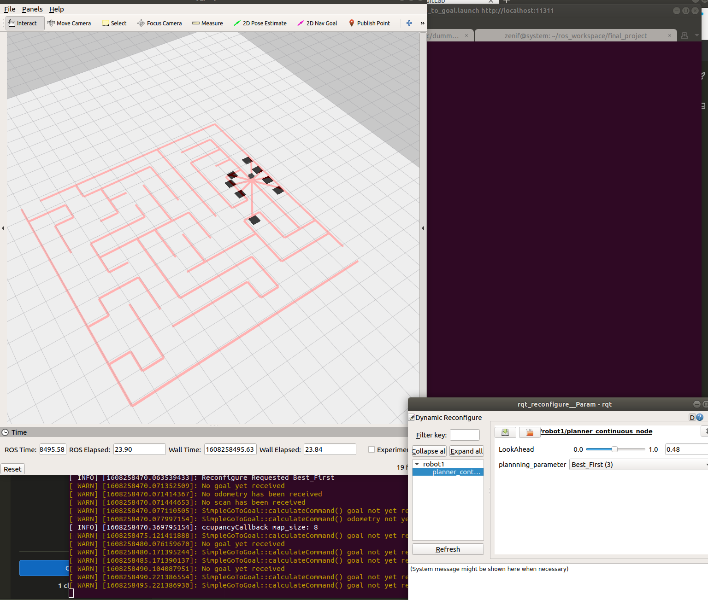
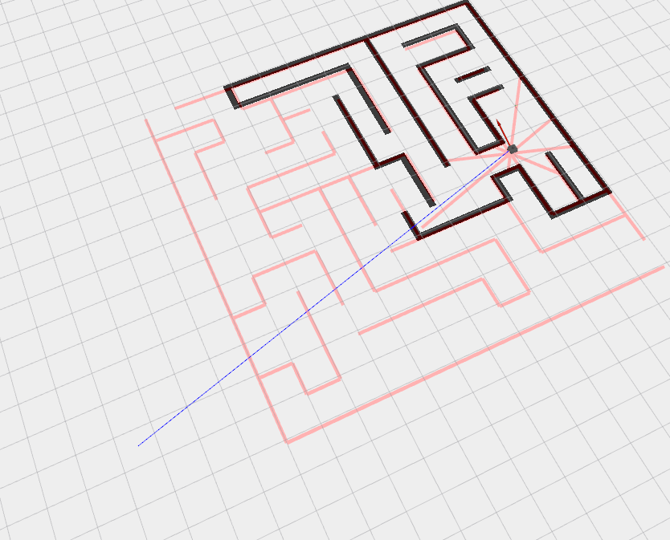
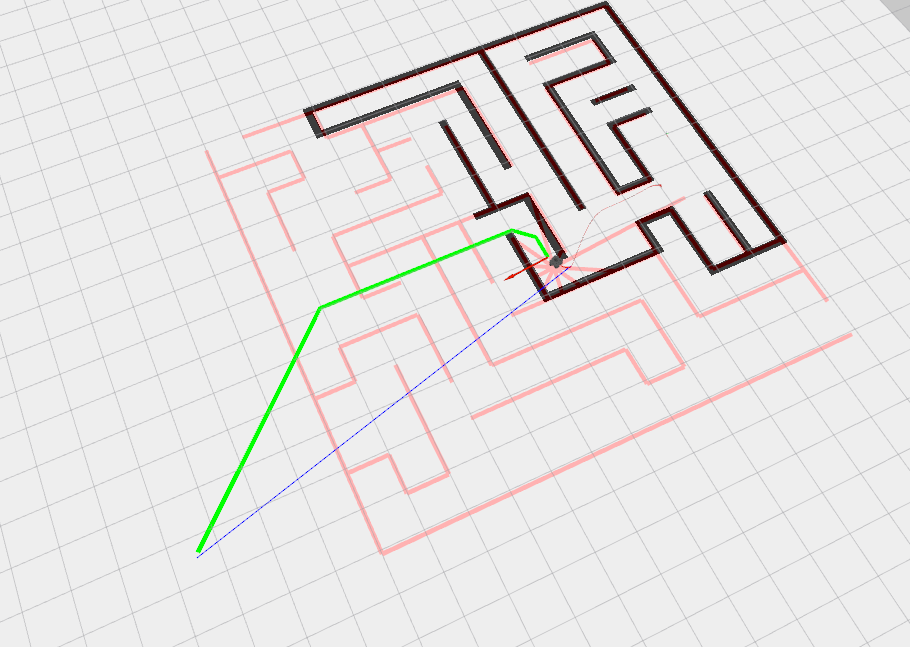

# This Install Guid

## Installation

To install, use

	$ sudo apt-get install python-wstool	

or when that is not possible, fall back to pip:

	$ sudo pip install -U wstool	

## Create a catkin Workspace with wstool
	$ mkdir ~/ros_catkin_ws 	

    $ cd ~/ros_catkin_ws 

## Initialize the Workspace from a rosinstall File

    $ wstool init src 

add the ```final_project.rosinstall``` file to add to the workspace, proceed to Merge in Additional rosinstall Files below. 

cd to the src folder
    cd src

    wstool merge final_project.rosinstall

## Updating the Workspace

    wstool up

This will update/download all the repositories


## Running The Project


Go up a directorry and build the project to ```ros_catkin_ws```

    cd ..
    catkin_make

sorce the devel 😈

    source devel/setup.bash

run the launch file

    roslaunch dummy_planner go_to_goal.launch 

After a few seconds you will see RViz 




## Be patient ⌛ 

Sometimes the algorithm can take a hot second to return a path especially the Dijkstra Planner. 




